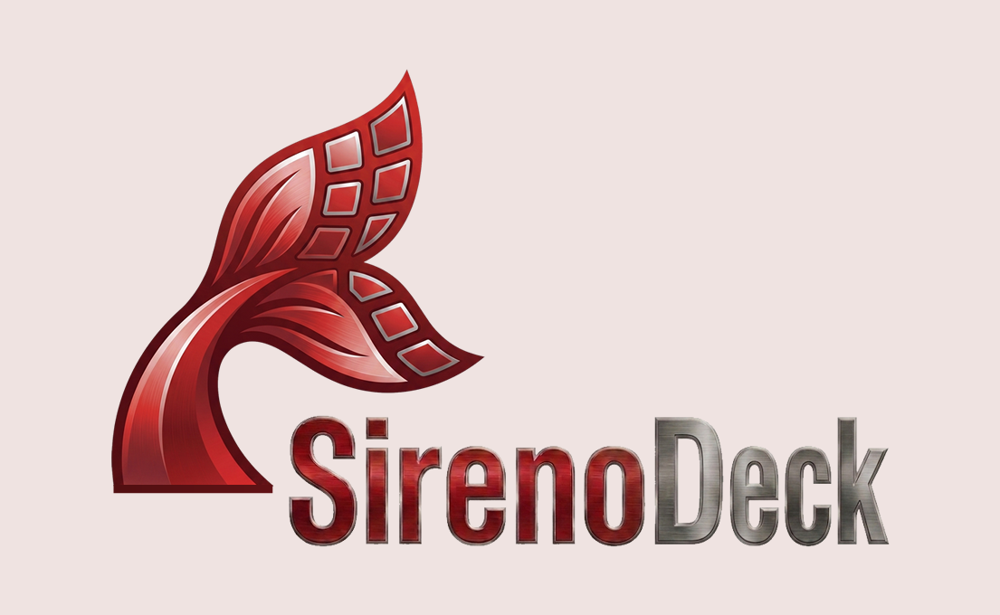
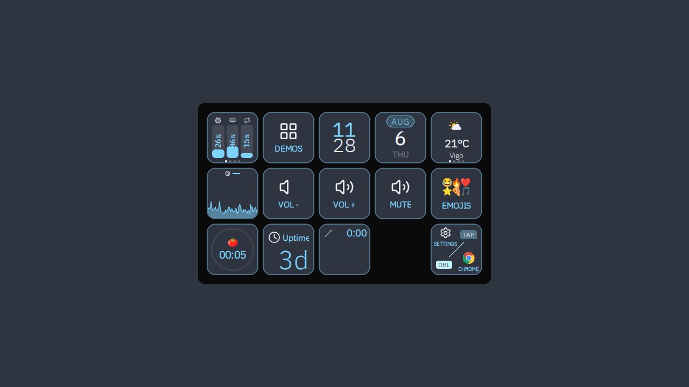
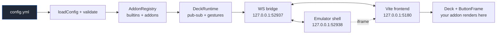
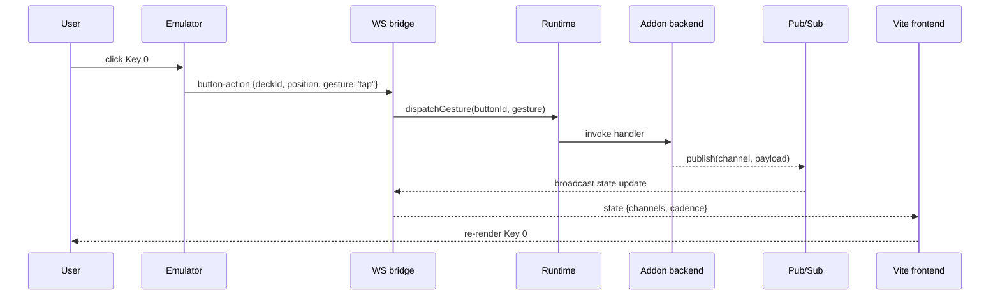

<p align="center">
  
  <br />
  <br />
  
</p>

<h1 align="center">Sireno Deck</h1>

<p align="center">
  A Node CLI that drives an Elgato Stream Deck from a YAML config.
  Same UI in the config UI, on real hardware, or behind a dev daemon.
</p>

<p align="center">
  <a href="LICENSE"></a>
  
  
  
</p>

## Features

- **YAML-driven decks** — one file, no JS required to use an addon.
- **Three surfaces from one code path** — config UI browser shell, real hardware, and a Vite dev SPA all run the same React 19 + Tailwind 4 frontend.
- **Addon API** — register custom button types, decks, and frontends. Eight built-in addons ship as TS source.
- **Cross-platform input** — `ydotool` (Linux), `osascript` (macOS), SendInput (Windows). Per-button gesture state machine for tap / dbl-tap / hold.
- **WebSocket bridge protocol** — single JSON protocol over `127.0.0.1`; surfaces are stateless.

## Getting started

### Install

```bash
pnpm install
```

### First run

The daemon writes a default `config.yml` to `$XDG_CONFIG_HOME/sirenodeck/config.yml` on first start, then walks you through the device model and addon catalog.

```bash
# Start the emulator (browser auto-opens at http://127.0.0.1:52938)
pnpm --silent run dev start --emulator

# Tail the daemon log
pnpm --silent run dev logs --follow

# Stop
pnpm --silent run dev stop
```

Drop your own `config.yml` next to the package you run from (or pass `--config <path>`) to override the default.

### CLI

```text
sirenodeck start    [--config <path>] [--port <N>] [--emulator]
                    [--device-model mk2|plus|mini|xl] [--http-port <N>]
                    [--logs]
sirenodeck stop
sirenodeck status
sirenodeck restart  [--logs]
sirenodeck reload   [--logs]            # in-place reload via SIGUSR1
sirenodeck logs     [--follow] [--lines <N>]
```

`start` daemonizes (writes a PID under `$XDG_RUNTIME_DIR/sirenodeck/`; authentication tokens remain in daemon memory); the foreground recipe for development is `pnpm run dev start` (wraps `tsx watch`, ignoring `frontend/**` so Vite keeps running).

### `config.yml` example

```yaml
theme: default

decks:
  main:
    name: Main
    buttons:
      - position: 2
        type: date-time:time
        config:
          variant: big

      - position: 3
        type: date-time:date

      - position: 1
        type: core:action
        config:
          command: "xdg-open https://example.com"

      - position: 4
        type: weather:weather
        config:
          location:
            latitude: 42.2304
            longitude: -8.7256
            name: Vigo

      - position: 0
        type: system-status:system-status
        config:
          pages:
            - type: bars
              metrics: [cpu, ram, disk]
            - type: kpis
              metrics: [temperature, uptime]

      - position: 9
        type: core:change-deck
        config:
          deck: emoji

  emoji:
    name: Emoji
    buttons:
      - position: 0
        type: core:change-deck
        config:
          deck: main
```

### Documentation

Full docs live in [`packages/cli/docs/`](packages/cli/docs/) (rendered by the Astro docs site):

- Getting started — [Installation](packages/cli/docs/user/installation.mdx), [Running the service](packages/cli/docs/user/running-the-service.mdx), [Configuration files](packages/cli/docs/user/configuration-files.mdx)
- Using Sireno Deck — [Decks and buttons](packages/cli/docs/user/decks-and-buttons.mdx), [Actions](packages/cli/docs/user/actions.mdx), [Text formatting](packages/cli/docs/user/text-formatting.mdx), [Icons](packages/cli/docs/user/icons.mdx), [Themes](packages/cli/docs/user/themes.mdx), [Emulator vs hardware](packages/cli/docs/user/emulator-vs-hardware.mdx), [Troubleshooting](packages/cli/docs/user/troubleshooting.mdx)
- Built-in addons — [Reference](packages/cli/docs/user/builtin-addons.mdx)
- Extending Sireno Deck — [Addon authoring](packages/cli/docs/developer/addon-authoring.mdx), [Theme authoring](packages/cli/docs/developer/theme-authoring.mdx), [Architecture](packages/cli/docs/developer/architecture.mdx), [Runtime API](packages/cli/docs/developer/runtime-api.mdx), [Protocol](packages/cli/docs/developer/protocol.mdx)
- Reference — [CLI commands](packages/cli/docs/reference/cli-commands.mdx), [Config schema](packages/cli/docs/reference/config-schema.mdx), [Addon API](packages/cli/docs/reference/addon-api.mdx), [Text tags](packages/cli/docs/reference/text-tags.mdx), [Macro syntax](packages/cli/docs/reference/macro-syntax.mdx)

## How it works



A button click flows back through the bridge to the runtime:



Every button gets its own WS handshake. The frontend reads `deck-config` and per-button-type surfaces from the theme; addons register React components via [`packages/cli/src/addon/api.ts`](packages/cli/src/addon/api.ts).

## For addon authors

Each addon packages as npm with `sirenodeck.json` manifest at version `1`. The loader installs it to `~/.cache/sirenodeck/node_modules/` on first run. See [`packages/cli/src/addon/api.ts`](packages/cli/src/addon/api.ts) for the API and [`docs/architecture/boundaries.md`](docs/architecture/boundaries.md) for what crosses each seam.

## License

MIT — see [`LICENSE`](LICENSE).
