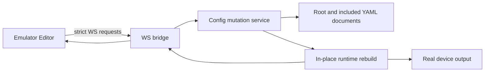

# Visual Config Editor - Plan

## Goal Capsule

- Add an emulator-hosted visual editor that changes the YAML configuration safely and updates the running deck immediately.
- Preserve the WS-only process boundary and the existing runtime as the source of truth.
- Stop when configured decks, addon overrides, themes, device selection, undo, and included YAML editing work without arbitrary filesystem writes.

## Product Contract

### Summary

The emulator gains an Editor tab for arranging and configuring decks while retaining the current device/emulator preview. Changes persist immediately, preview live, and can be undone during the session.

### Problem Frame

The current emulator is a useful read-only preview but configuration remains a manual YAML task. The runtime already materializes decks, addon buttons, themes, and device-specific layouts, so the editor should reuse those paths rather than create a second deck model.

### Requirements

#### Editor surface

- R1. Start the emulator surface in both hardware and emulation modes; expose only the appropriate device choices for each mode and preserve real-device selection through the existing system.
- R2. Show the active deck with addon-provided buttons and decks grouped by addon, plus a separate theme tab.
- R3. Allow adding, moving, deleting, duplicating, copying, and pasting buttons, with a configuration aside for schema-supported button settings and live preview.
- R4. Allow editing addon-generated decks through persisted addon/deck overrides; generated buttons remain addon-owned.

#### Persistence and safety

- R5. Persist each valid edit immediately and refresh the runtime without requiring a restart.
- R6. Keep session undo history and expose both Ctrl+Z and an undo control.
- R7. Preserve included YAML structure; included-file editing may target only YAML files explicitly present in the resolved include graph, never arbitrary files or non-YAML files.

### Scope Boundaries

- Deferred: public CLI mutation commands, MCP integration, persistent undo across restarts, and materializing generated decks into user YAML.
- Excluded: arbitrary filesystem editing, direct runtime-only mutations, shell execution, and editing internal/system addon types.

## Planning Contract

### Key Technical Decisions

- KTD1. Use one authenticated WS editor protocol and a host-side validated mutation service rather than browser filesystem access (session-settled: user-approved - chosen over a UI-only or direct-file approach: the emulator must safely drive the running runtime).
- KTD2. Persist through YAML document/source-graph mutation with atomic writes, not stringify of expanded config, so comments and `!include` boundaries survive (session-settled: user-directed - chosen over flattening includes: included YAML remains editable without destroying its structure).
- KTD3. Use Zod 4 JSON Schema serialization for supported addon form fields and reject or clearly surface unsupported schemas rather than inventing addon-specific React editors (session-settled: user-directed - chosen over addon-provided editors: schema-driven controls are the first-version contract).
- KTD4. Treat generated and paginated decks as runtime projections; mutations address source deck IDs, source button indexes/positions, or addon override records, never synthesized runtime IDs.
- KTD5. Rebuild deck materialization in place after a successful mutation and preserve providers/addon services; theme changes additionally refresh the frontend iframe.
- KTD6. Keep public CLI/MCP adapters deferred until the mutation contract has stabilized, but make the host mutation service reusable by those future adapters.

### High-Level Technical Design

The Node process owns config source graphs, validation, mutation history, device inventory, and runtime rebuilds. The emulator requests editor state and mutations over the existing authenticated WS bridge. The editor canvas reuses the frontend iframe for rendering and owns only edit overlays and drag/drop input. The server returns updated editor state and broadcasts the normal deck/runtime messages so hardware and emulator converge.

### Assumptions

- The root config remains editable through the visual editor; the YAML text tab is restricted to included `.yaml`/`.yml` files.
- The first schema renderer supports JSON-Schema primitives, objects, arrays, enums, defaults, and descriptions; unsupported schemas report an actionable editor error.
- A single daemon owns writes for a config path; stale external edits are rejected or reloaded rather than silently overwritten.

### Implementation Units

#### U1. Config source graph and mutation service

- **Goal:** Safely mutate root and included YAML while validating every change.
- **Files:** `packages/cli/src/config/loader.ts`, `packages/cli/src/config/schemas.ts`, `packages/cli/src/config/validation.ts`, `packages/cli/src/config/mutation.ts`, `packages/cli/src/config/__tests__/mutation.test.ts`.
- **Approach:** Extend include resolution with source ownership, mutate `yaml` documents in place, serialize writes through an atomic queue, retain session snapshots, and expose structured validation/conflict errors.
- **Test scenarios:** Add/reorder/delete/update buttons; addon overrides; comments and include boundaries survive; non-YAML or non-included paths are rejected; invalid schema edits do not write; write failure leaves the prior file intact; undo restores the previous valid snapshot.

#### U2. Editor protocol and runtime refresh

- **Goal:** Connect mutations to the live runtime and both transports.
- **Files:** `packages/cli/src/api/protocol-internal.ts`, `packages/cli/src/render/ws-bridge.ts`, `packages/cli/src/cli/commands/run.ts`, `packages/cli/src/deck/deck-config.ts`, `packages/cli/src/config/config-diff.ts`, related tests.
- **Approach:** Add strict editor request/result/state frames, expose serializable addon/theme/device metadata, extract reusable in-place rebuild logic, and ensure config/action/theme changes are not misclassified as unchanged decks.
- **Test scenarios:** Authentication and malformed requests; live updates; pagination, overlays, lock/system slot, themes, real hardware, emulator models, reconnect, and stale revision handling.

#### U3. Always-on emulator and device behavior

- **Goal:** Run the emulator shell in hardware and emulation modes with correct device inventory.
- **Files:** `packages/cli/src/outputClient/real.ts`, `packages/cli/src/outputClient/emulator.ts`, `packages/cli/src/cli/commands/run.ts`, `packages/cli/config-ui/src/App.tsx`, `packages/cli/config-ui/src/SidePanel.tsx`, tests.
- **Approach:** Keep real output for hardware while starting the emulator surface as an additional observer/editor; use real-device inventory in hardware mode and virtual models only in emulation mode.
- **Test scenarios:** No hardware, one hardware device, multiple devices, persisted selection, model changes, and emulator startup/shutdown.

#### U4. Editor metadata and schema forms

- **Goal:** Make addon buttons/decks and themes editable through serializable metadata.
- **Files:** `packages/cli/src/cli/commands/addon-registry.ts`, `packages/cli/src/cli/commands/run.ts`, `packages/cli/config-ui/src/pages/EditorPage.tsx`, editor components/tests.
- **Approach:** Hide internal types, serialize supported service schemas with `z.toJSONSchema`, expose generated-deck override capability, and render a small schema-driven form.
- **Test scenarios:** Builtin/external addons, schema defaults/enums/nested fields, unsupported schemas, missing themes, and internal item filtering.

#### U5. Editor canvas interactions

- **Goal:** Provide responsive drag/drop editing over the existing deck preview.
- **Files:** `packages/cli/config-ui/src/App.tsx`, `packages/cli/config-ui/src/DeckFrame.tsx`, `packages/cli/config-ui/src/pages/EditorPage.tsx`, `packages/cli/config-ui/src/components/*`, tests.
- **Approach:** Reuse the iframe deck rendering and add accessible overlay controls for empty slots, drag targets, button menus, clipboard, duplicate, delete, undo, and keyboard shortcuts.
- **Test scenarios:** Add/reorder/delete/duplicate/copy/paste, configure and preview a button, keyboard operation, mobile layout, and error/reconnect states.

#### U6. Documentation and verification

- **Goal:** Document and manually verify the new editor behavior.
- **Files:** `packages/cli/docs/user/emulator-vs-hardware.mdx`, relevant addon/config docs, browser tests if present.
- **Approach:** Document persistence, undo scope, include restrictions, addon schema expectations, and hardware behavior; run the repository verification recipe and real browser checks.
- **Test scenarios:** Full emulator startup, editor flow, restart persistence, include editing, hardware parity, and clean shutdown.

## Verification Contract

- `pnpm lint`
- `pnpm format`
- `pnpm typecheck`
- `pnpm test --run`
- Start the emulator with the repository command and verify editor state, iframe rendering, WS connection, hardware/emulator device behavior, included YAML restrictions, and clean shutdown.

## Definition of Done

- All requirements R1-R7 are implemented and covered by focused tests or explicit browser verification.
- No arbitrary filesystem path can be selected or edited by the include editor.
- Runtime and hardware preview reflect valid edits without restart.
- Invalid edits cannot corrupt or partially write configuration.
- No dead-end implementation or unused abstraction remains.
